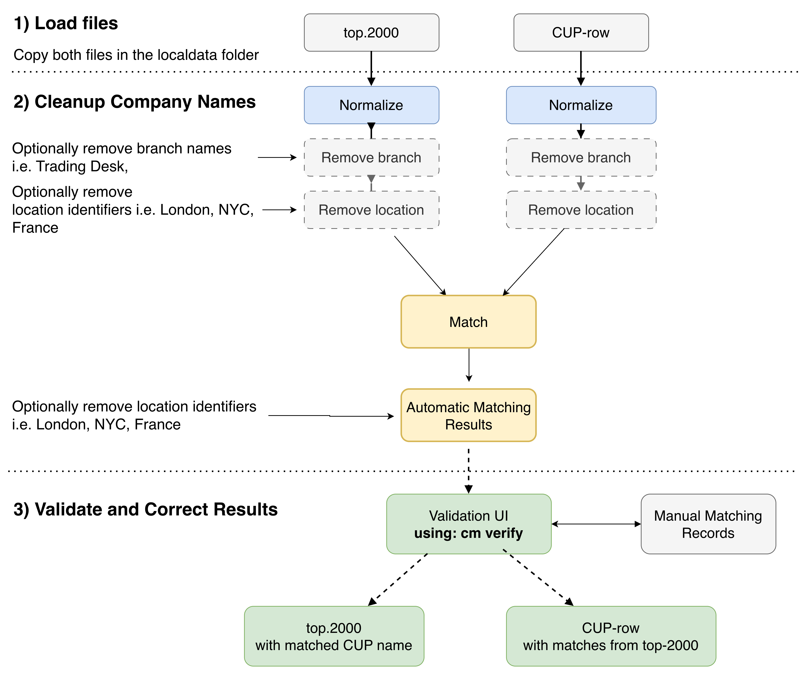
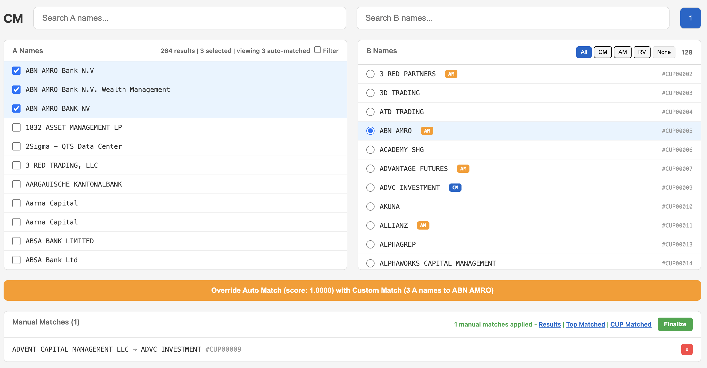

# cm — Company Name Matching

A company name matching system that finds the best match for a given company name against a reference list. It combines deterministic scoring (token overlap, fuzzy similarity, acronym detection) with optional semantic embeddings and LLM arbitration via Google Gemini on Vertex AI.


Automated matching pipeline.

## How It Works

The matcher runs a 4-stage pipeline for each input name:

### Stage 1: Candidate Generation

Narrows down the full reference list to a manageable set of candidates using two strategies:

- **Lexical blocking** — groups names by shared n-gram keys and retrieves candidates that share blocking keys with the query.
- **Embedding ANN** (when Gemini is enabled) — computes vector embeddings for all names using `text-embedding-004`, then retrieves the nearest neighbors by cosine similarity. This catches semantic matches that lexical blocking would miss (e.g. abbreviations, translations).

### Stage 2: Scoring

Each candidate is scored against the query using a weighted combination of:

| Feature | Weight | Description |
|---------|--------|-------------|
| Token overlap | 0.35 | Jaccard-style overlap of core tokens |
| Fuzzy similarity | 0.30 | RapidFuzz token-sort ratio |
| Acronym signal | 0.20 | Detects when one name is an acronym of the other |
| Semantic similarity | 0.15 | Cosine similarity of embeddings (0 if disabled) |

Penalties are applied for numeric mismatches and very short names.

### Stage 3: Decision Bands

The top-scored candidate is classified into one of three decisions:

- **MATCH** — score >= 0.92 and margin over runner-up >= 0.06
- **NO_MATCH** — score <= 0.75
- **REVIEW** — everything in between (ambiguous)

### Stage 4: LLM Arbitration (optional)

When Gemini is enabled, REVIEW cases are sent to `gemini-2.0-flash` for a second opinion. The LLM receives structured evidence (original names, tokens, feature scores) and returns a JSON verdict (`SAME`, `DIFFERENT`, or `UNSURE` with a confidence score). Gating rules prevent wasteful calls:

- Both sides must have at least 2 core tokens (or the call is skipped)
- Numeric conflicts are never sent to the LLM
- A global call cap (default 50) limits total LLM usage per run

## Setup

```bash
uv sync
```

### Gemini / Vertex AI Authentication

The Gemini providers use Vertex AI with Application Default Credentials (ADC). No API key is needed — authenticate with `gcloud auth application-default login`:

```bash
# One-time: install gcloud CLI
# https://cloud.google.com/sdk/docs/install

# Authenticate
gcloud auth application-default login

# Set your GCP project
gcloud config set project <YOUR_PROJECT_ID>
```

The project is resolved from (in order):
1. `GOOGLE_CLOUD_PROJECT` environment variable
2. `gcloud config get-value project`

The location defaults to `us-central1` (override with `GOOGLE_CLOUD_LOCATION`).

## Usage

```bash
# Full pipeline with Gemini (embeddings + LLM arbitration)
uv run cm match

# Deterministic only (no Gemini calls)
uv run cm match --no-gemini

# Group-based matching (deduplicates identical A names first)
uv run cm match --group

# Custom file paths
uv run cm match --top path/to/top.xlsx --cup path/to/cup.xlsx --output results.xlsx
```

### Input Files

- `--top` — Excel file with company names to match in column `A`
- `--cup` — Excel file with reference names in column `CUP_NAME` (and `CUP_ID` for output)

### Output

An Excel file with columns:

| Column | Description |
|--------|-------------|
| A_name | Original input name |
| matched_CUP_NAME | Best match from reference list (if MATCH) |
| matched_CUP_ID | CUP_ID of the matched reference |
| decision | MATCH, NO_MATCH, or REVIEW |
| score | Composite similarity score (0–1) |
| runner_up_score | Score of the second-best candidate |
| reasons | Scoring breakdown |


### Interactive UI for verification



Interactive matching UI.


## Commands

### `cm match`

Run the matching pipeline to match company names from file A against reference names in file B.

```bash
# Full pipeline with Gemini (embeddings + LLM arbitration)
uv run cm match

# Deterministic only (no Gemini calls)
uv run cm match --no-gemini

# Group-based matching (deduplicates identical A names first)
uv run cm match --group

# Display matches on screen
uv run cm match --show

# Custom file paths
uv run cm match --top path/to/top.xlsx --cup path/to/cup.xlsx --output results.xlsx

# Include manual matches from a JSON file
uv run cm match --matches manual_matches.json
```

**Options:**

| Option | Default | Description |
|--------|---------|-------------|
| `--top` | `localdata/top_2000_unmapped.xlsx` | Excel file with names to match (column `A`) |
| `--cup` | `localdata/CUP_raw_data.xlsx` | Excel file with reference names (columns `CUP_NAME`, `CUP_ID`) |
| `--output` | `localdata/matching_results.xlsx` | Output Excel file path |
| `--matches` | `manual_matches.json` | Path to manual matches JSON file |
| `--group` | off | Group identical A names and match once per unique name |
| `--show` | off | Display matches on screen after processing |

---

### `cm dupes`

Find duplicate names in both input files. Useful for data quality checks before matching.

```bash
# Find duplicates (exact match)
uv run cm dupes

# Find duplicates with normalization (groups by normalized form)
uv run cm dupes --no institution --no location
```

**Options:**

| Option | Default | Description |
|--------|---------|-------------|
| `--top` | `localdata/top_2000_unmapped.xlsx` | Excel file with names to check (column `A`) |
| `--cup` | `localdata/CUP_raw_data.xlsx` | Excel file with reference names (column `CUP_NAME`) |

---

### `cm clean`

Generate cleaned versions of names with different normalization levels. Outputs Excel files showing original names alongside various normalized forms.

```bash
# Generate cleaned files
uv run cm clean

# Filter and display names matching a string (instead of writing files)
uv run cm clean --filter "bank"
uv run cm clean -f "securities"

# Custom input/output paths
uv run cm clean --top input.xlsx --output-top cleaned_top.xlsx
```

**Options:**

| Option | Default | Description |
|--------|---------|-------------|
| `--top` | `localdata/top_2000_unmapped.xlsx` | Excel file with names (column `A`) |
| `--cup` | `localdata/CUP_raw_data.xlsx` | Excel file with reference names (column `CUP_NAME`) |
| `--output-top` | `localdata/top_cleaned.xlsx` | Output path for cleaned top file |
| `--output-cup` | `localdata/cup_cleaned.xlsx` | Output path for cleaned cup file |
| `--filter`, `-f` | none | Filter and display names matching this string (case-insensitive) |

---

### `cm verify`

Launch an interactive web UI for manual verification and matching. Opens a browser to review matches, search reference names, and create manual match overrides.

```bash
# Start the verify UI
uv run cm verify

# Custom port
uv run cm verify --port 9000

# Custom file paths
uv run cm verify --top input.xlsx --cup reference.xlsx --results results.xlsx
```

**Options:**

| Option | Default | Description |
|--------|---------|-------------|
| `--top` | `localdata/top_2000_unmapped.xlsx` | Excel file with names to match (column `A`) |
| `--cup` | `localdata/CUP_raw_data.xlsx` | Excel file with reference names |
| `--matches` | `manual_matches.json` | Path to manual matches file (read/write) |
| `--results` | `localdata/matching_results.xlsx` | Path to automatic matching results (for displaying auto-matches) |
| `--port` | `8765` | Server port |

---

### `cm finalize`

Apply manual matches to automatic matching results. Creates a final output file with manual overrides merged in.

```bash
# Finalize with defaults
uv run cm finalize

# Custom paths
uv run cm finalize --results auto_results.xlsx --matches manual.json --output final.xlsx
```

**Options:**

| Option | Default | Description |
|--------|---------|-------------|
| `--results` | `localdata/matching_results.xlsx` | Path to automatic matching results |
| `--matches` | `manual_matches.json` | Path to manual matches JSON file |
| `--output` | `localdata/finalized_matching_results.xlsx` | Output path for finalized results |

---

## Global Options

These options are available for all commands:

| Option | Default | Description |
|--------|---------|-------------|
| `--log-level` | `INFO` | Set logging level (`DEBUG`, `INFO`, `WARNING`, `ERROR`) |
| `--no-gemini` | off | Disable Gemini providers (use deterministic matching only) |
| `--no CATEGORY` | none | Strip words from a category during normalization (repeatable) |

**Normalization categories** (use with `--no`):

- `institution` — Bank, Trust, Securities, etc.
- `location` — Country and city names
- `stopwords` — Common words (The, And, Of, etc.) — enabled by default

Example:
```bash
uv run cm match --no institution --no location
```

## Configuration Files

The `config_data/` directory contains configuration files that control normalization and matching behavior. All `.txt` files use a simple one-word-per-line format; `.json` files use key-value mappings.

**Custom location:** Set the `CM_CONFIG_DATA` environment variable to override the default path.

### Word Lists (`.txt` files)

| File | Purpose |
|------|---------|
| `stopwords.txt` | Common words stripped during normalization (`the`, `of`, `and`, `for`, `a`, `an`). Always applied. |
| `designators_global.txt` | Legal entity suffixes stripped from all names (`inc`, `corp`, `ltd`, `llc`, `gmbh`, `ag`, etc.). Always applied. |
| `institution.txt` | Financial institution terms (`bank`, `capital`, `securities`, `fund`, `trust`, etc.). Stripped when `--no institution` is used. |
| `location.txt` | Geographic terms (`usa`, `europe`, `asia`, `germany`, `apac`, `emea`, etc.). Stripped when `--no location` is used. |
| `branch.txt` | Branch/business type words (similar to institution). Used for specialized matching scenarios. |
| `acronym_collision.txt` | Short strings that commonly collide as false-positive acronyms (`abc`, `aaa`, `aab`). Excluded from acronym detection. |

### JSON Configuration

| File | Purpose |
|------|---------|
| `designator_aliases.json` | Maps abbreviations to canonical forms before stripping. Examples: `"inc."` → `"inc"`, `"l.l.c."` → `"llc"`, `"intl"` → `"international"`. |
| `replacements.json` | Character replacements applied early in normalization. Currently maps `&` and `+` to `and`. |

### Customization

To add words to a category, edit the corresponding `.txt` file (one word per line, lowercase). Changes take effect on the next run.

Example — add "holdings" to the institution list:
```
# data/institution.txt
bank
...
holdings
```

## Programmatic Usage

```python
from cm import Matcher, MatchConfig, GeminiEmbeddingProvider, GeminiLLMProvider
from cm.gemini import _make_client

client = _make_client()
matcher = Matcher(
    config=MatchConfig(),
    embedding_provider=GeminiEmbeddingProvider(client),
    llm_provider=GeminiLLMProvider(client),
)

matcher.preprocess_b(["Acme Corp", "Globex Inc", ...])
result = matcher.match_one("ACME Corporation")
print(result.decision, result.score)
```
